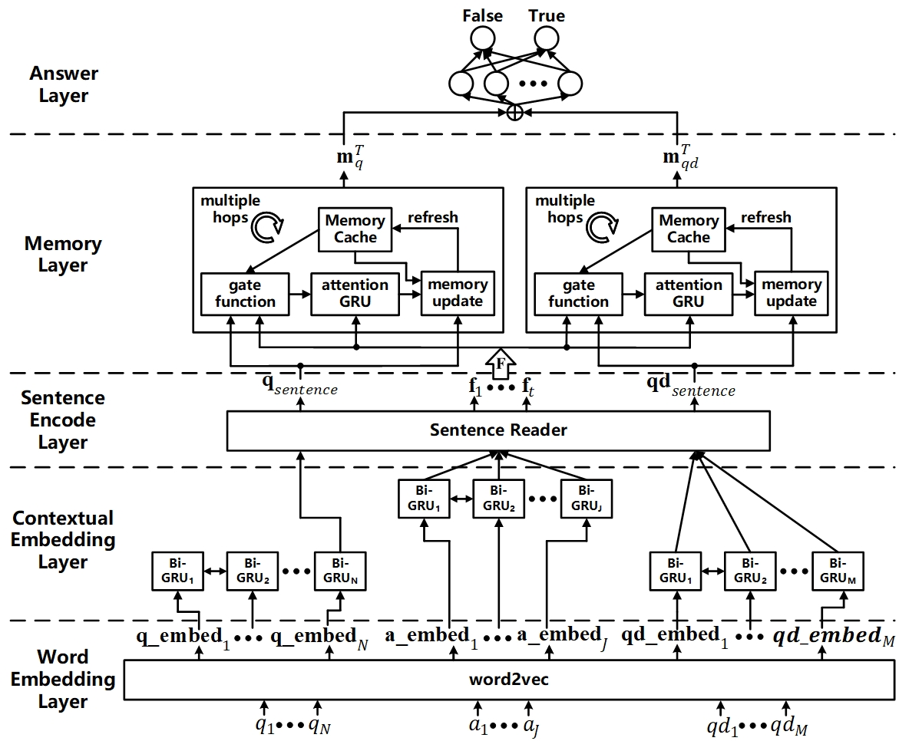

# Epilepsy QA System
  
## Data source
We collected epilepsy data by use web crawler from some website, the form of raw data as follow:
~~~
{
    "_id" : ObjectId("5b768fb956339877d3d947a3"),
    "illnessType" : "癫痫",
    "Q" : "老年人群体为什么外伤容易导致癫痫",
    "Q_detailed" : "外公患上癫痫之后，相知道老年人群体为什么外伤容易导致癫痫",
    "A1" : "任何年龄的脑外伤后都可能发生癫痫病，一般脑外伤后要服二年的抗癫痫病药物预防。\n      指导意见：\n      癫痫病一旦确诊，就需要严格按医生分咐，按时按量，长期服用抗癫痫病药物治疗，不能随便减量，更不能随便停药。"
}
~~~

## Model
Our Q&A model mainly refer to [DMN] and [DMN+].  
Model frame as the following picture:

## QA System Web Server
We use Flask to build a background server, and write a front-end page. Our model deploy on the background server. User can input their question, our system will return a answer.  
The front-end page as the following picture:

# Environment
+ pymongo                3.7.1  
+ jieba                  0.39     
+ numpy                  1.14.5   
+ pandas                 0.23.3     
+ gensim                 3.5.0       
+ tqdm                   4.25.0
+ tensorflow             1.9.0   
+ Flask                  1.0.2

# How to run
if you want load and preprocess data, build and train word2vec (CBOW), build, train and test model, you can run the code as follow:
~~~
  sh run.sh
~~~
if you want start QA System Web Server, you can run the code as follow:
~~~
  modelPath='../model_build_train_dev_test/logs/2019-04-26@12_34_08-batchSize20-epoch10-embeddingSize150-dropout0.0-hidden_units80-hops3-lr0.001-randSeed1000/model/model-5'
  sh run_qa_system_web_server.sh -m modelPath
~~~

[DMN]: http://proceedings.mlr.press/v48/kumar16.pdf
[DMN+]: http://proceedings.mlr.press/v48/xiong16.pdf
